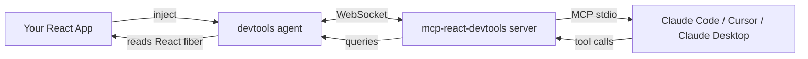

<div align="center">

# 🪞 mcp-react-devtools

**Model Context Protocol server that exposes React internals to Claude Code**

_Stop screenshotting your component tree to debug UI bugs. Just ask Claude — it can see your app._

[](https://modelcontextprotocol.io)
[](https://www.typescriptlang.org)
[](https://react.dev)
[](LICENSE)

</div>

---

## 🎯 The problem

You're debugging a React app. You ask Claude: _"why isn't this dropdown closing on outside click?"_

Claude responds: _"Could you share the component code, the parent component, the state, and any event handlers attached?"_

You spend 5 minutes copy-pasting context. Claude reads it. Asks 3 more questions. You give up and `console.log` everything.

**This MCP server fixes that.** Claude can now query your running React app directly — component tree, props, state, hook values, event listeners — without you copying anything.

## 🛠️ What Claude can do

Once connected, Claude has these tools:

| Tool | What it does |
|---|---|
| `react_tree` | Returns the full component tree of your running app |
| `react_inspect_component` | Get props, state, hooks, and source location of any component by selector |
| `react_get_state` | Read live state from a Redux/Zustand/MobX store |
| `react_listen_render` | Subscribe to render events for the next N seconds |
| `react_diff_state` | Compare state at two points in time (great for "what changed when I clicked X?") |
| `react_find_renders_by` | Find components that re-rendered more than N times in last second |

## 💬 Example conversation

> **You:** The submit button on the checkout form stays disabled even after I fill all fields.
>
> **Claude:** _Calling `react_inspect_component({selector: "CheckoutForm > SubmitButton"})..._
>
> **Claude:** Found it — `SubmitButton` reads `isValid` from the wrong scope. The parent `CheckoutForm` has its own `isValid` derived from `react-hook-form`, but `SubmitButton` is reading from a stale closure of the form context (lines 47-52 of `SubmitButton.tsx`). The form's `isValid` is `true`, but the button still sees `false`.
>
> Fix: replace the destructured `isValid` with `formContext.formState.isValid` so it stays reactive.

## 🏗️ Architecture



## 🚀 Quick start

### 1. Install the agent in your app

```bash
npm install --save-dev mcp-react-devtools
```

```tsx
// In your app's entry (e.g., main.tsx)
if (import.meta.env.DEV) {
  import("mcp-react-devtools/agent").then(({ installAgent }) => {
    installAgent({ port: 9474 });
  });
}
```

### 2. Add the MCP server to Claude Code

```json
// ~/.config/claude/mcp.json
{
  "mcpServers": {
    "react-devtools": {
      "command": "npx",
      "args": ["-y", "mcp-react-devtools", "--port", "9474"]
    }
  }
}
```

### 3. Restart Claude Code, run your app, ask away

```
You: what re-rendered in the last 3 seconds?
Claude: [calls react_listen_render({duration: 3000})]
        TodoList re-rendered 47 times. Looks like Item.onChange
        creates a new function every parent render — pass it
        memoized via useCallback.
```

## 🔒 Safety

- ✅ **Dev-only by default** — agent refuses to install in production builds
- ✅ **Port restricted to localhost** — never exposed to the network
- ✅ **Read-only** — Claude can't *modify* your app, only inspect it
- ✅ **Audit log** — every tool call logged to `.mcp-react-devtools.log`

## 🧠 Why I built this

I work across 3 React Native apps and 2 Next.js apps daily. The dev-cycle of "screenshot → describe → wait" was burning hours per week. Claude with direct React access changed that — it's like having a senior engineer pair-programming who can see what I see.

This is **v0.4** — the original prototype only handled function components. v0.2 added hook introspection. v0.3 added store integration (Redux + Zustand + MobX). v0.4 adds time-travel via state diffs.

## 📜 License

MIT

## 👋 Author

Built by [@hii24](https://github.com/hii24) · Frontend Engineer · daily MCP user since 2024
